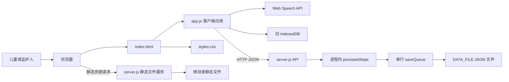
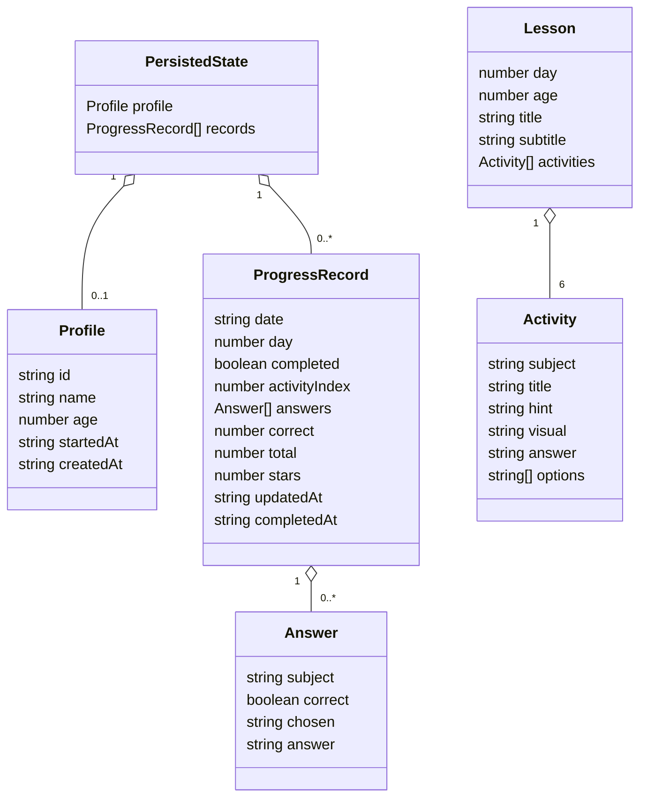

# 架构说明

本文说明稳定的模块边界与数据契约；运行时的先后顺序见[运行流程](./flows.md)，操作命令见[开发指南](./development.md)。

## 总体架构

图中边界来自 [`index.html`](../../index.html) 的资源加载、[`app.js`](../../app.js) 的 `api`/`migrateLegacyState`/`speak`，以及 [`server.js`](../../server.js) 的请求分派和 `persistState`。

## 模块边界与依赖方向

| 模块 | 对外职责 | 允许依赖 | 不负责 |
| --- | --- | --- | --- |
| HTML 壳 | 提供 `#app`、`#toast` 和静态资源入口 | `styles.css`、`app.js` | 业务状态与路由 |
| 客户端应用 | 生成课程、管理当前视图、渲染交互、计算统计、调用 API | DOM、Fetch、Web Speech、旧 IndexedDB | 权威持久化、静态文件传输 |
| HTTP 服务 | 静态资源分发、API 路由、最小输入校验 | Node.js 内置模块、文件系统 | 课程生成与页面渲染 |
| JSON 存储 | 保存一份应用状态 | 本地文件系统 | 多用户隔离、查询、事务数据库能力 |
| 部署层 | 构建镜像、注入端口和数据路径、挂载卷、健康检查 | Docker/Compose | 业务逻辑 |

依赖方向是浏览器端单向调用服务端 API，服务端再单向写文件；服务端不导入客户端代码。部署层包裹运行时而不被业务代码引用。依据分别为 [`app.js`](../../app.js)、[`server.js`](../../server.js)、[`Dockerfile`](../../Dockerfile) 和 [`compose.yaml`](../../compose.yaml)。

## 客户端内部边界

[`app.js`](../../app.js) 是单文件模块，可按职责理解为四组：

- 内容与生成：`MATH_THEMES`、`WORDS`、`seeded`、`makeLesson`。种子为学习天数与年龄的组合，同一天、同年龄会得到相同课程。
- 状态与派生：`state`、`dayNumber`、`completedToday`、`todayDraft`、`streak`。
- 视图与交互：各 `render*`、`answerQuestion`、`nextActivity`、`bindNavigation`。
- 数据适配：`api`、`saveProfile`、`saveRecord` 以及旧 IndexedDB 读取/迁移函数。

这些只是当前代码中的职责分组，并非独立文件或可导入模块；若未来拆分，需要先建立模块加载或打包方案。

## 核心数据结构

以下结构依据 [`app.js`](../../app.js) 的写入点和 [`server.js`](../../server.js) 的读取/校验整理。项目没有 JSON Schema 或 TypeScript 类型定义。

字段存在两种记录形态：

| 形态 | 必需于当前写入逻辑的字段 | 产生位置 |
| --- | --- | --- |
| 未完成断点 | `date`、`day`、`completed: false`、`activityIndex`、`answers`、`updatedAt` | `answerQuestion` |
| 已完成汇总 | `date`、`day`、`completed: true`、`correct`、`total`、`stars`、`answers`、`completedAt` | `nextActivity` |

服务端以 `date` 为记录唯一键，`PUT /api/progress` 会插入或覆盖同日记录；资料固定要求 `id === "main"` 且年龄属于 3、4、5、6。服务端对进度记录只校验日期格式，其余字段契约由客户端维持，见 [`server.js`](../../server.js) 的 `handleApi`。

## API 与持久化边界

| 方法与路径 | 作用 | 服务端校验 |
| --- | --- | --- |
| `GET /api/state` | 返回完整状态 | 无 |
| `PUT /api/profile` | 新建或覆盖资料 | `id`、名称类型、年龄集合 |
| `PUT /api/progress` | 按日期新建或覆盖进度 | `date` 为 `YYYY-MM-DD` 形式 |
| `DELETE /api/state` | 清空资料与记录 | 无 |

[`server.js`](../../server.js) 在启动时同步读取数据文件；写入通过 `saveQueue` 串行化，先写同目录 `.tmp` 文件再重命名。状态仍以进程内 `persistedState` 为请求期间的权威副本，因此当前设计是单进程、单数据文件、单资料模型。

## 相关文档

- 项目定位与入口：[项目概览](./overview.md)
- 关键请求和状态转换：[运行流程](./flows.md)
- 约束、验证与已知风险：[开发指南](./development.md)

