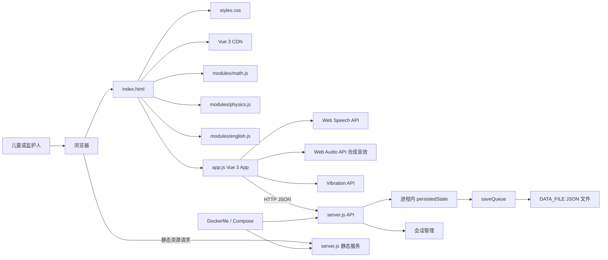
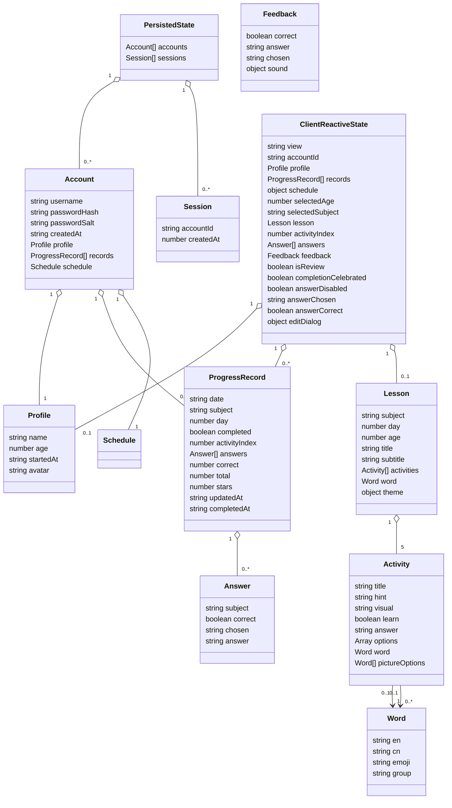

# 架构说明

本文描述稳定的模块边界与数据契约；运行时先后顺序请见[运行流程](./flows.md)，操作与验证请见[开发指南](./development.md)。

## 总体架构

资源加载、浏览器能力和 API 调用来自 [`index.html`](../../index.html) 与 [`app.js`](../../app.js)；Vue 3 通过 CDN 加载，学科模块（`modules/`）独立加载并挂载到 `window` 全局；服务端分派与文件写入来自 [`server.js`](../../server.js)。

## 模块边界与依赖方向

| 模块 | 对外职责 | 直接依赖 | 不负责 |
| --- | --- | --- | --- |
| HTML 壳 | 提供挂载节点并加载 Vue 3、样式与脚本 | CSS、Vue 3 CDN、客户端脚本、学科模块 | 业务状态与 API |
| 学科模块 | 按年龄和天数确定性生成课程数据（5 活动/课） | 无（纯函数） | DOM 渲染、API 调用 |
| 客户端应用 | 课程协调、Vue 3 响应式状态管理、模板渲染、统计、数据调用、答题反馈、庆祝特效与合成音效 | DOM、Vue 3、Fetch、Web Speech、Web Audio、Vibration、学科模块 | 权威持久化、静态资源传输 |
| HTTP 服务 | 静态文件分发、API 路由、账户认证、会话管理、最小输入校验 | Node.js 内置 `http`/`fs`/`path`/`crypto`、文件系统 | 课程生成、DOM 渲染 |
| JSON 存储 | 保存多账户完整应用状态 | 本地文件系统 | 多用户隔离、查询、数据库事务 |
| 部署层 | 构建镜像、配置端口与数据卷、健康检查 | Docker / Compose | 业务逻辑 |

浏览器单向调用服务端 API，服务端单向写入文件；服务端不加载客户端脚本，业务代码也不引用 Docker 配置。这些关系可由 [`app.js`](../../app.js)、[`server.js`](../../server.js)、[`Dockerfile`](../../Dockerfile)、[`compose.yaml`](../../compose.yaml) 直接验证。

静态资源和 API 共用同一个 HTTP 服务：`/api/` 前缀先进入 API 分派，其余路径按相对于 `SOURCE_DIR` 的文件处理；服务端以解析后的绝对路径限制访问范围，越界路径返回 `403`。允许的 MIME 映射和路径检查都在 [`server.js`](../../server.js) 中。它不是访问控制或用户隔离机制，部署边界的风险见[开发指南](./development.md)。

## 客户端内部职责

`app.js` 是客户端核心文件（Vue 3 Composition API 应用），学科模块（`modules/`）负责课程数据生成。可按下列职责维护；这些分组不是实际的独立模块。

| 分组 | 主要成员 | 作用 |
| --- | --- | --- |
| 响应式状态 | `ref`/`reactive` 声明的 ~30 个状态变量（`view`、`profile`、`records`、`schedule`、`lesson`、`activityIndex`、`answers`、`feedback` 等） | 管理视图和从记录计算状态 |
| 计算属性 | `computed` 声明的 ~10 个派生值（`streakCount`、`todaySubjects`、`subjectLessonDays`、`currentActivity`、`totalActivities`、`progressPercent` 等） | 从响应式状态派生的统计与 UI 数据 |
| 课程协调 | `loadSubjectModule`、`makeSubjectLesson`、`startSubjectLesson` | 按学科加载对应模块并生成课程 |
| 视图与交互 | Vue 模板中的 `v-if`/`v-for`/`@click` 绑定、`answerQuestion`、`nextActivity`、`exitLesson`、`navigate` | 条件渲染、列表渲染、事件处理 |
| 反馈与庆祝 | `playFeedbackSound`、`playVehicleSound`、`audioTone`、`celebrateWithParticles`、`showSuccessBadge`、`speak` | 合成音效、粒子动画、庆祝徽章和语音朗读 |
| 数据适配 | `api`、`saveProfile`、`saveRecord`、`loadUserState` | 访问服务端 API |
| 导航 | `navItems` 计算属性、`navigate` 函数、底部导航栏模板 | 底部导航栏与视图路由 |

上述成员均见 [`app.js`](../../app.js)。学科模块（`math.js`、`physics.js`、`english.js`）通过 `index.html` 的 `<script>` 标签加载到 `window` 全局，各自导出 `{THEMES/WORDS, generateLesson}` 接口。若未来拆分文件，是否引入模块加载或打包工具属于**待确认**，因为仓库目前没有对应配置。

## 庆祝反馈系统

答对题目时，客户端协调三级反馈，全部通过 Web Audio API 合成，无需外部音频文件（见 [`app.js`](../../app.js)）：

| 反馈层级 | 实现函数 | 效果 |
| --- | --- | --- |
| 粒子特效 | `celebrateWithParticles("correct", 30)` | 30 个彩带/星星/心形粒子从中心向四周扩散，带随机颜色和延迟 |
| 庆祝徽章 | `showSuccessBadge(sound)` | 顶部弹出弹跳徽章，显示车辆 emoji、名称和祝贺文案 |
| 合成音效 | `playFeedbackSound("correct", vehicle)` | 上行音阶（C₅-E₅-G₅）后接随机车辆主题音效（火车/消防车/警车/校车） |

`SUCCESS_SOUNDS` 数组定义了四种车辆主题（火车/消防车/警车/校车），每条记录包含 `name`、`emoji`、`cheer` 文案和 `sound` 音效类型键。每次答对随机选取一种。课程完成时调用 `playFeedbackSound("complete")` 播放四音阶（C₅-E₅-G₅-C₆）和 `celebrateWithParticles("complete", 24)` 全屏庆祝。`completionCelebrated` 标志防止重复渲染时再次触发特效。

## 核心数据结构

项目没有 JSON Schema 或 TypeScript 类型定义；下图依据客户端写入点与服务端读取/校验逻辑整理，见 [`app.js`](../../app.js)、[`server.js`](../../server.js)。

| 记录形态 | 当前写入字段 | 产生处 |
| --- | --- | --- |
| 未完成断点 | `date`、`subject`、`day`、`completed: false`、`activityIndex`、`answers`、`total`、`updatedAt` | `answerQuestion` |
| 已完成汇总 | `date`、`subject`、`day`、`completed: true`、`correct`、`total`、`stars`、`answers`、`completedAt` | `nextActivity` |

`Activity.options` 的元素在数学活动中是数字字符串、在英语活动中是单词字符串；带图片选项的英语活动另有 `word` 与 `pictureOptions`。`ClientReactiveState` 中的 `lesson`、`activityIndex`、`answers`、`feedback`、`isReview`、`completionCelebrated`、`answerDisabled`、`answerChosen`、`answerCorrect` 和 `editDialog` 仅在客户端内存中存在，不写入服务端持久化状态，见 [`app.js`](../../app.js)。

## API 与持久化边界

| 方法与路径 | 作用 | 认证要求 | 服务端校验 |
| --- | --- | --- | --- |
| `POST /api/auth/register` | 注册新账户 | 无 | 用户名 ≥2 字符、密码 ≥4 字符、宝宝小名非空、年龄 3–6 |
| `POST /api/auth/login` | 登录并创建会话 | 无 | 用户名密码匹配 |
| `POST /api/auth/logout` | 清除会话 | 无 | 无 |
| `GET /api/state` | 返回当前账户完整状态 | 需要登录 | 无 |
| `PUT /api/profile` | 更新宝宝资料 | 需要登录 | 名称非空、年龄 3–6 |
| `PUT /api/progress` | 按日期+学科新建或覆盖进度 | 需要登录 | `date` 符合 `YYYY-MM-DD`、`subject` 为 `math`/`physics`/`english` |
| `DELETE /api/state` | 清空当前账户的记录和开始日期 | 需要登录 | 无 |
| `GET /api/schedule` | 获取当前账户课表 | 需要登录 | 无 |
| `PUT /api/schedule` | 更新当前账户课表 | 需要登录 | 7 天键值、每项学科为有效值 |
| `GET /api/export/html` | 导出学习报告 HTML | 需要登录 | 无 |
| `GET /api/accounts` | 列出所有账户（用于切换） | 需要登录 | 无 |

服务端以 `accountId` 为账户键，以 `date` + `subject` 为进度记录键。认证使用 `yuanbao_session` Cookie（HttpOnly、SameSite=Lax、7 天有效期），密码通过 PBKDF2-SHA512 加盐哈希存储。启动时读取文件，写入时将完整内存快照写到同目录临时文件后重命名，并用 `saveQueue` 串行化同一进程内写入。因此它是单进程、单数据文件、多账户模型，见 [`server.js`](../../server.js)。

`PUT /api/progress` 不会按上表之外的字段拒绝请求：除 `date` 和 `subject` 外，记录字段由客户端提供并原样保存。这是当前接口契约，不应据此假定存在字段级权限或版本兼容保证；演进时需同步检查客户端读写点与[运行流程](./flows.md)。

## 课表系统

默认课表按星期排列（周日休息），各账户可独立修改并存为持久化状态：

| 星期 | 默认学科 |
| --- | --- |
| 周日（0） | 无（休息） |
| 周一（1） | 数学、英语 |
| 周二（2） | 物理、数学 |
| 周三（3） | 英语、物理 |
| 周四（4） | 数学、英语 |
| 周五（5） | 物理、数学 |
| 周六（6） | 英语 |

课表通过 `GET /api/schedule` 读取、`PUT /api/schedule` 更新，客户端可逐日编辑并可选恢复默认值，见 [`server.js`](../../server.js) 与 [`app.js`](../../app.js) 的 `openEditDialog`、`saveEditDialog`、`resetSchedule`。

## 相关文档

- [项目概览](./overview.md)：定位、技术栈、目录和入口。
- [运行流程](./flows.md)：请求、状态变化与持久化时序。
- [开发指南](./development.md)：验证方式与架构风险。