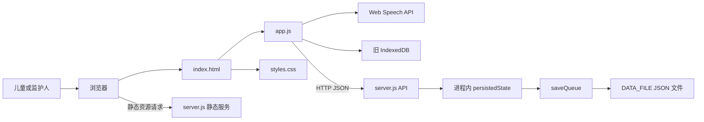
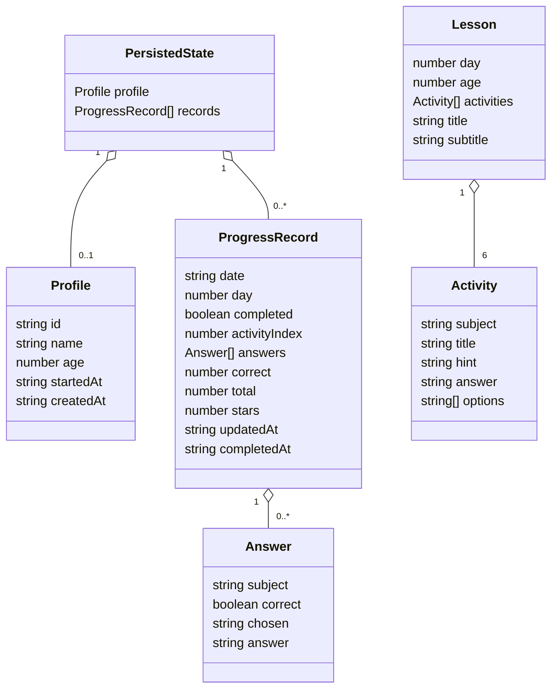

# 架构说明

本文描述稳定的模块边界与数据契约；运行时先后顺序请见[运行流程](./flows.md)，操作与验证请见[开发指南](./development.md)。

## 总体架构

资源加载、浏览器能力和 API 调用来自 [`index.html`](../../index.html) 与 [`app.js`](../../app.js)；服务端分派与文件写入来自 [`server.js`](../../server.js)。

## 模块边界与依赖方向

| 模块 | 对外职责 | 直接依赖 | 不负责 |
| --- | --- | --- | --- |
| HTML 壳 | 提供挂载节点并加载资源 | CSS、客户端脚本 | 业务状态与 API |
| 客户端应用 | 课程生成、状态管理、页面渲染、统计、数据调用 | DOM、Fetch、Web Speech、旧 IndexedDB | 权威持久化、静态资源传输 |
| HTTP 服务 | 静态文件分发、API 路由、最小输入校验 | Node.js 内置模块、文件系统 | 课程生成、DOM 渲染 |
| JSON 存储 | 保存一份完整应用状态 | 本地文件系统 | 多用户隔离、查询、数据库事务 |
| 部署层 | 构建镜像、配置端口与数据卷、健康检查 | Docker / Compose | 业务逻辑 |

浏览器单向调用服务端 API，服务端单向写入文件；服务端不加载客户端脚本，业务代码也不引用 Docker 配置。这些关系可由 [`app.js`](../../app.js)、[`server.js`](../../server.js)、[`Dockerfile`](../../Dockerfile)、[`compose.yaml`](../../compose.yaml) 直接验证。

## 客户端内部职责

`app.js` 是当前唯一的客户端业务文件，可按下列职责维护；这些分组不是实际的独立模块。

| 分组 | 主要成员 | 作用 |
| --- | --- | --- |
| 内容与生成 | `MATH_THEMES`、`WORDS`、`seeded`、`makeLesson` | 按天数与年龄确定性生成课程 |
| 状态与派生 | `state`、`dayNumber`、`todayDraft`、`streak` | 管理视图和从记录计算状态 |
| 视图与交互 | `render*`、`answerQuestion`、`nextActivity` | 用模板字符串渲染并处理点击 |
| 数据适配 | `api`、`saveProfile`、`saveRecord`、迁移函数 | 访问服务端及读取旧 IndexedDB |

上述成员均见 [`app.js`](../../app.js)。若未来拆分文件，是否引入模块加载或打包工具属于**待确认**，因为仓库目前没有对应配置。

## 核心数据结构

项目没有 JSON Schema 或 TypeScript 类型定义；下图依据客户端写入点与服务端读取/校验逻辑整理，见 [`app.js`](../../app.js)、[`server.js`](../../server.js)。

| 记录形态 | 当前写入字段 | 产生处 |
| --- | --- | --- |
| 未完成断点 | `date`、`day`、`completed: false`、`activityIndex`、`answers`、`updatedAt` | `answerQuestion` |
| 已完成汇总 | `date`、`day`、`completed: true`、`correct`、`total`、`stars`、`answers`、`completedAt` | `nextActivity` |

## API 与持久化边界

| 方法与路径 | 作用 | 服务端校验 |
| --- | --- | --- |
| `GET /api/state` | 返回完整状态 | 无 |
| `PUT /api/profile` | 新建或覆盖资料 | `id === "main"`、名称为字符串、年龄为 3–6 |
| `PUT /api/progress` | 按日期新建或覆盖进度 | `date` 符合 `YYYY-MM-DD` |
| `DELETE /api/state` | 清空资料和记录 | 无 |

服务端以 `date` 为进度记录键。启动时读取文件，写入时将完整内存快照写到同目录临时文件后重命名，并用 `saveQueue` 串行化同一进程内写入。因此它是单进程、单数据文件、单资料模型，见 [`server.js`](../../server.js)。

## 相关文档

- [项目概览](./overview.md)：定位、技术栈、目录和入口。
- [运行流程](./flows.md)：请求、状态变化与持久化时序。
- [开发指南](./development.md)：验证方式与架构风险。
