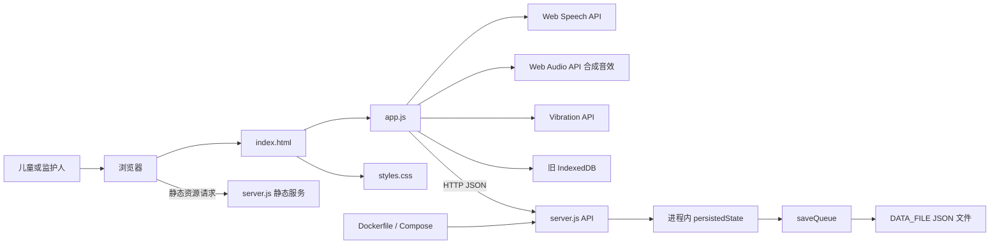
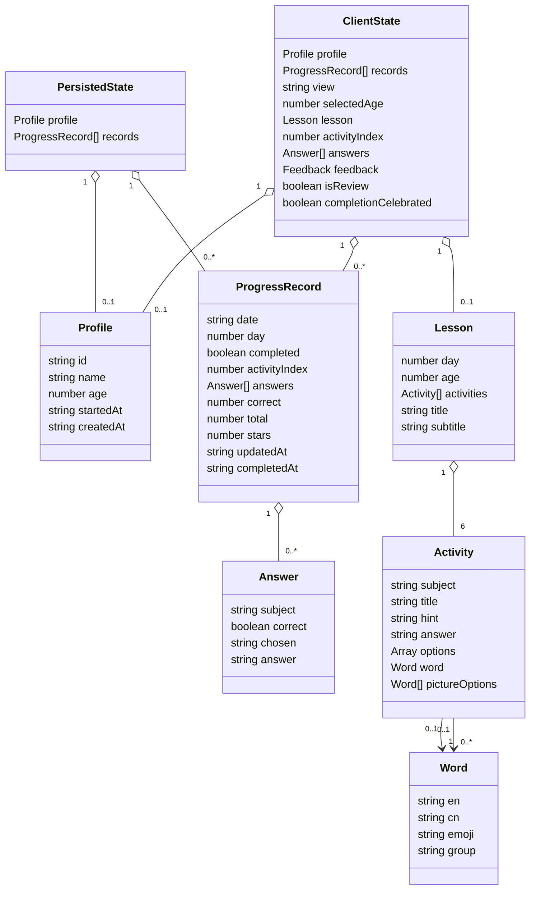

# 架构说明

本文描述稳定的模块边界与数据契约；运行时先后顺序请见[运行流程](./flows.md)，操作与验证请见[开发指南](./development.md)。

## 总体架构

资源加载、浏览器能力和 API 调用来自 [`index.html`](../../index.html) 与 [`app.js`](../../app.js)；服务端分派与文件写入来自 [`server.js`](../../server.js)。

## 模块边界与依赖方向

| 模块 | 对外职责 | 直接依赖 | 不负责 |
| --- | --- | --- | --- |
| HTML 壳 | 提供挂载节点并加载资源 | CSS、客户端脚本 | 业务状态与 API |
| 客户端应用 | 课程生成、状态管理、页面渲染、统计、数据调用、答题反馈、庆祝特效与合成音效 | DOM、Fetch、Web Speech、Web Audio、Vibration、旧 IndexedDB | 权威持久化、静态资源传输 |
| HTTP 服务 | 静态文件分发、API 路由、最小输入校验 | Node.js 内置模块、文件系统 | 课程生成、DOM 渲染 |
| JSON 存储 | 保存一份完整应用状态 | 本地文件系统 | 多用户隔离、查询、数据库事务 |
| 部署层 | 构建镜像、配置端口与数据卷、健康检查 | Docker / Compose | 业务逻辑 |

浏览器单向调用服务端 API，服务端单向写入文件；服务端不加载客户端脚本，业务代码也不引用 Docker 配置。这些关系可由 [`app.js`](../../app.js)、[`server.js`](../../server.js)、[`Dockerfile`](../../Dockerfile)、[`compose.yaml`](../../compose.yaml) 直接验证。

静态资源和 API 共用同一个 HTTP 服务：`/api/` 前缀先进入 API 分派，其余路径按相对于 `SOURCE_DIR` 的文件处理；服务端以解析后的绝对路径限制访问范围，越界路径返回 `403`。允许的 MIME 映射和路径检查都在 [`server.js`](../../server.js) 中。它不是访问控制或用户隔离机制，部署边界的风险见[开发指南](./development.md)。

## 客户端内部职责

`app.js` 是当前唯一的客户端业务文件，可按下列职责维护；这些分组不是实际的独立模块。

| 分组 | 主要成员 | 作用 |
| --- | --- | --- |
| 内容与生成 | `MATH_THEMES`、`WORDS`、`SUCCESS_SOUNDS`、`seeded`、`makeLesson` | 按天数与年龄确定性生成课程，以及随机选择庆祝主题 |
| 状态与派生 | `state`、`dayNumber`、`todayDraft`、`streak` | 管理视图和从记录计算状态 |
| 视图与交互 | `render*`、`answerQuestion`、`nextActivity`、`exitLesson` | 用模板字符串渲染并处理点击 |
| 反馈与庆祝 | `playFeedbackSound`、`playVehicleSound`、`audioTone`、`celebrateWithParticles`、`showSuccessBadge`、`showAnswerEffect`、`speak` | 合成音效、粒子动画、庆祝徽章和语音朗读 |
| 数据适配 | `api`、`saveProfile`、`saveRecord`、迁移函数 | 访问服务端及读取旧 IndexedDB |

上述成员均见 [`app.js`](../../app.js)。若未来拆分文件，是否引入模块加载或打包工具属于**待确认**，因为仓库目前没有对应配置。

## 庆祝反馈系统

答对题目时，`showAnswerEffect` 协调三级反馈，全部通过 Web Audio API 合成，无需外部音频文件（见 [`app.js`](../../app.js)）：

| 反馈层级 | 实现函数 | 效果 |
| --- | --- | --- |
| 粒子特效 | `celebrateWithParticles("correct", 30)` | 30 个彩带/星星/心形粒子从中心向四周扩散，带随机颜色和延迟 |
| 庆祝徽章 | `showSuccessBadge(sound)` | 顶部弹出弹跳徽章，显示车辆 emoji、名称和祝贺文案 |
| 合成音效 | `playFeedbackSound("correct", vehicle)` | 上行音阶（C₅-E₅-G₅）后接随机车辆主题音效（火车/消防车/警车/校车） |

`SUCCESS_SOUNDS` 数组定义了四种车辆主题，每次答对随机选取一种。课程完成时调用 `playFeedbackSound("complete")` 播放四音阶（C₅-E₅-G₅-C₆）和 `celebrateWithParticles("complete", 24)` 全屏庆祝。`completionCelebrated` 标志防止重复渲染时再次触发特效。

## 核心数据结构

项目没有 JSON Schema 或 TypeScript 类型定义；下图依据客户端写入点与服务端读取/校验逻辑整理，见 [`app.js`](../../app.js)、[`server.js`](../../server.js)。

| 记录形态 | 当前写入字段 | 产生处 |
| --- | --- | --- |
| 未完成断点 | `date`、`day`、`completed: false`、`activityIndex`、`answers`、`updatedAt` | `answerQuestion` |
| 已完成汇总 | `date`、`day`、`completed: true`、`correct`、`total`、`stars`、`answers`、`completedAt` | `nextActivity` |

`Activity.options` 的元素在数学活动中是数字、在英语活动中是字符串；带图片选项的英语活动另有 `word` 与 `pictureOptions`。`ClientState` 中的 `lesson`、`activityIndex`、`answers`、`feedback`、`isReview` 和 `completionCelebrated` 仅在客户端内存中存在，不写入服务端持久化状态，见 [`app.js`](../../app.js)。

## API 与持久化边界

| 方法与路径 | 作用 | 服务端校验 |
| --- | --- | --- |
| `GET /api/state` | 返回完整状态 | 无 |
| `PUT /api/profile` | 新建或覆盖资料 | `id === "main"`、名称为字符串、年龄为 3–6 |
| `PUT /api/progress` | 按日期新建或覆盖进度 | `date` 符合 `YYYY-MM-DD` |
| `DELETE /api/state` | 清空资料和记录 | 无 |

服务端以 `date` 为进度记录键。启动时读取文件，写入时将完整内存快照写到同目录临时文件后重命名，并用 `saveQueue` 串行化同一进程内写入。因此它是单进程、单数据文件、单资料模型，见 [`server.js`](../../server.js)。

`PUT /api/progress` 不会按上表之外的字段拒绝请求：除 `date` 外，记录字段由客户端提供并原样保存。`GET /api/state` 也会返回整个状态对象。这是当前接口契约，不应据此假定存在字段级权限或版本兼容保证；演进时需同步检查客户端读写点与[运行流程](./flows.md)。

## 相关文档

- [项目概览](./overview.md)：定位、技术栈、目录和入口。
- [运行流程](./flows.md)：请求、状态变化与持久化时序。
- [开发指南](./development.md)：验证方式与架构风险。