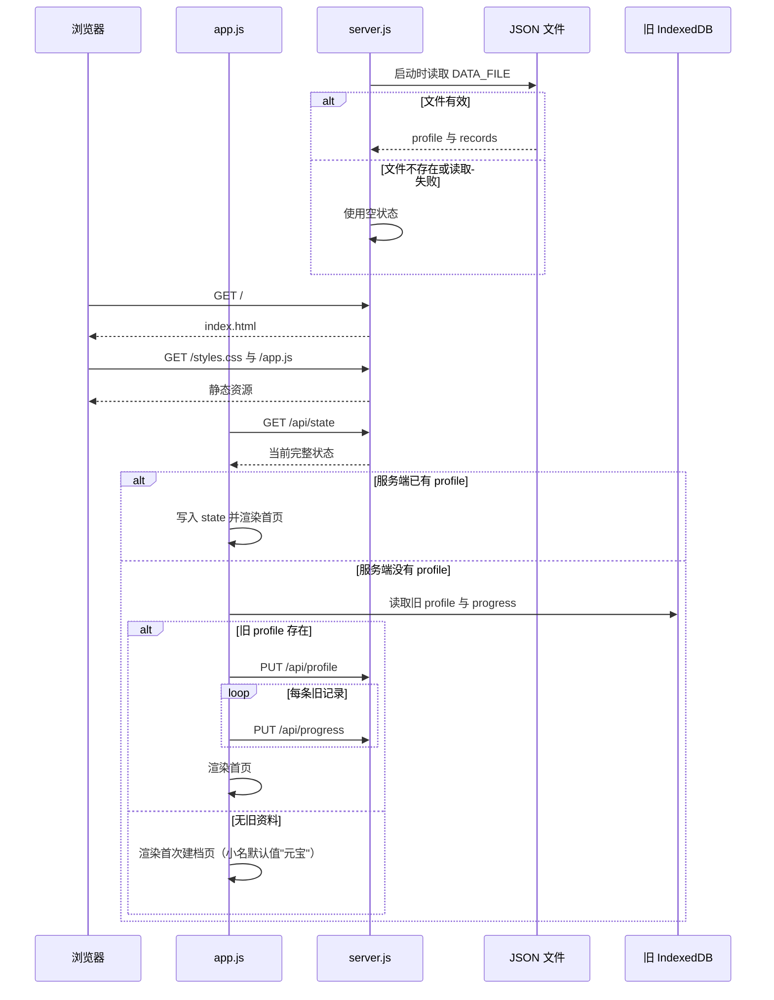
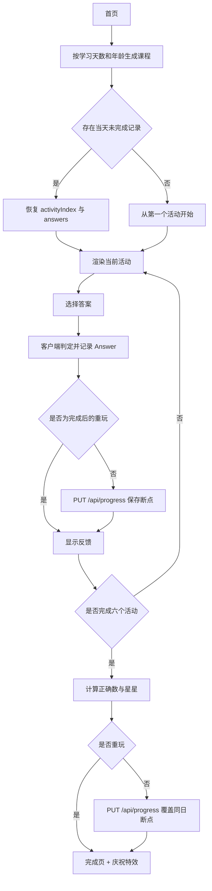
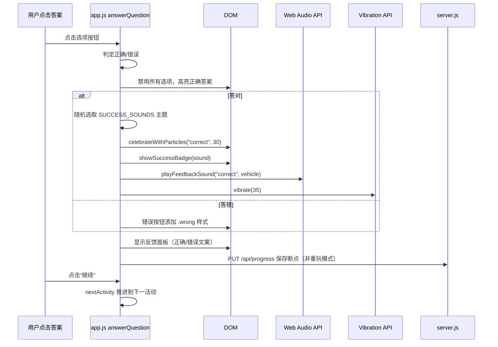
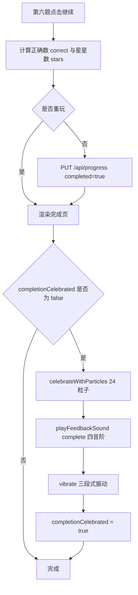
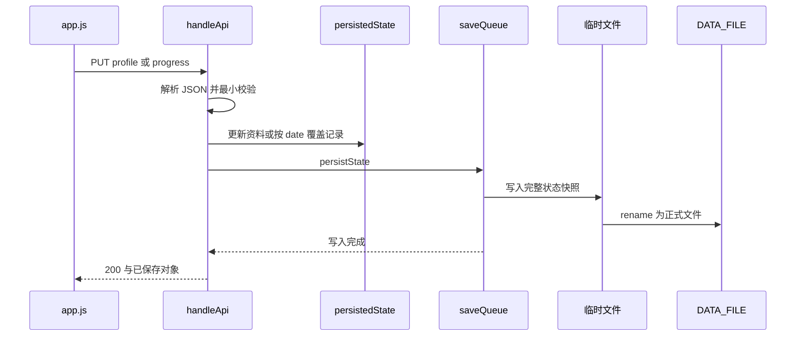

# 运行流程

本文关注运行时顺序与数据流；静态模块职责见[架构说明](./architecture.md)。

## 启动与初始化

服务端启动时读取 `SOURCE_DIR`、`PORT`、`DATA_FILE`，调用 `loadState()` 尝试读取 JSON；文件不存在或读取/解析失败时使用空状态。浏览器加载页面后，`app.js` 的 `init()` 请求状态并选择首页或首次建档页。首次建档页的宝宝小名输入框预填默认值 `"元宝"`（见 [`app.js`](../../app.js) 的 `renderOnboarding`）。依据为 [`server.js`](../../server.js) 和 [`app.js`](../../app.js)。

旧 IndexedDB 迁移只会在服务端没有 `profile` 时触发；迁移成功后不会自动删除旧数据库。仅用户执行"清除全部学习数据"时，客户端会删除该 IndexedDB，见 [`app.js`](../../app.js) 的 `init`、`migrateLegacyState`、`resetData`。

## 建档与每日学习

首次建档会提交固定 `id: "main"`、用户输入的小名、3–6 岁年龄、本地日期和创建时间；服务端校验并持久化。课程不从服务端下载，而是客户端使用学习天数和年龄调用 `makeLesson` 生成。天数从 `startedAt` 与客户端本地日期计算；种子是 `day * 7919 + age * 101`，课程包含固定六个活动。依据为 [`app.js`](../../app.js) 的 `renderOnboarding`、`dayNumber`、`makeLesson`，以及 [`server.js`](../../server.js) 的 `/api/profile` 分支。

首次作答会禁用选项并显示正确答案。非重玩模式每题立即保存断点；第六题后以 `max(1, round(correct / 2))` 计算星星，并覆盖同日记录。重玩只显示反馈，不改写既有成绩，见 [`app.js`](../../app.js) 的 `startLesson`、`answerQuestion`、`nextActivity`。

## 答题反馈与庆祝流程

每次答题后，客户端触发多级反馈；所有音效通过 Web Audio API 合成，不依赖外部音频文件。答对时随机选择车辆主题（火车/消防车/警车/校车），见 [`app.js`](../../app.js) 的 `SUCCESS_SOUNDS`、`showAnswerEffect`、`playFeedbackSound`、`playVehicleSound`。

课程完成时，`renderComplete` 在首次渲染时触发完成庆祝，`completionCelebrated` 标志防止重复：

英语发音使用浏览器的 `speechSynthesis`、`en-US` 语言；不支持时只显示提示，学习可继续。答对和完成课程还会尽力调用 Web Audio API 与 `navigator.vibrate` 提供反馈；这些能力不可用或播放失败时不会中断答题流程，见 [`app.js`](../../app.js) 的 `speak`、`playFeedbackSound`、`showAnswerEffect`、`renderComplete`。

## 服务端写入

请求体限制为 1 MiB。`saveQueue` 避免同一进程内的文件写入交叉；写入的是完整快照而非增量日志，见 [`server.js`](../../server.js) 的 `MAX_BODY_SIZE`、`readJson`、`persistState`。

客户端只有在 `PUT /api/progress` 成功后才将该记录合并进 `state.records`；答题断点写入失败时会保留当前页面上的答题反馈并显示提示。完成页保存没有单独的 `try/catch`，因此保存失败时会由该异步事件处理的异常表现决定，是否有统一的全局错误捕获属于**待确认**；相关实现见 [`app.js`](../../app.js) 的 `saveRecord`、`answerQuestion`、`nextActivity`。

## 统计与清除

- 首页从完成记录计算课程数、连续天数和近七天打卡；当日未完成记录决定进度条，见 [`app.js`](../../app.js) 的 `streak`、`renderWeek`、`renderHome`。
- 成长页只统计 `completed` 记录，按 `subject` 计算数学和英语正确率，并最多展示最近 10 节，见 [`app.js`](../../app.js) 的 `renderProgress`。
- 清除操作需浏览器确认；之后 `DELETE /api/state` 保存空状态，删除旧 IndexedDB 并刷新，见 [`app.js`](../../app.js) 的 `resetData` 和 [`server.js`](../../server.js)。

## 相关文档

- [项目概览](./overview.md)：入口与部署位置。
- [架构说明](./architecture.md)：数据结构与 API 边界。
- [开发指南](./development.md)：如何复现、检查与调试这些流程。