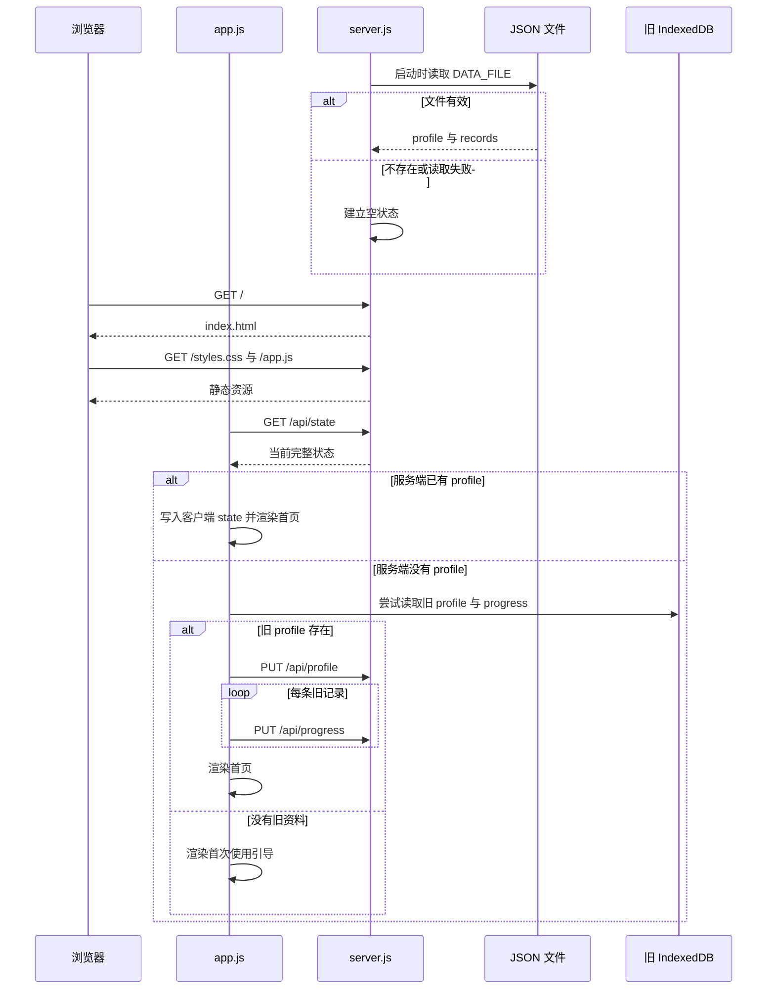
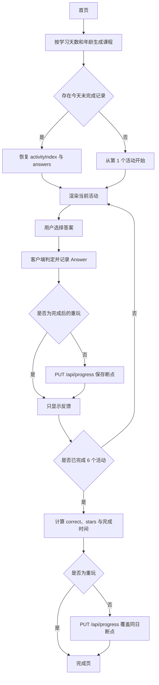
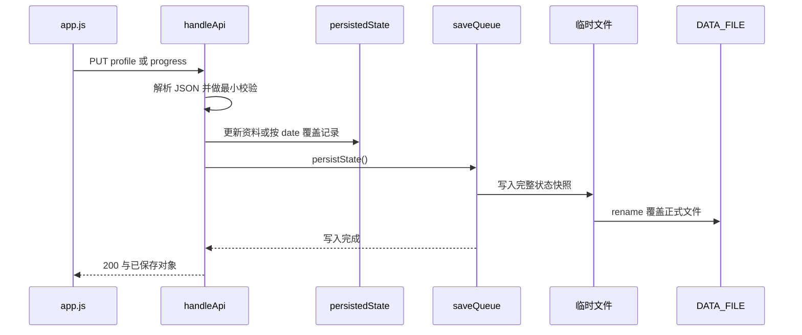

# 运行流程

本文聚焦运行时顺序与数据流；静态模块职责见[架构说明](./architecture.md)。

## 启动与初始化

服务端执行 [`server.js`](../../server.js) 时先解析 `SOURCE_DIR`、`PORT`、`DATA_FILE`，再通过 `loadState()` 读取 JSON；文件不存在或内容无法解析时使用 `{ profile: null, records: [] }`。浏览器加载 [`index.html`](../../index.html) 和 [`app.js`](../../app.js) 后执行 `init()`。

迁移只在服务端没有 `profile` 时触发；实现依据是 [`app.js`](../../app.js) 的 `init`、`migrateLegacyState`。旧数据库不会在迁移成功后自动删除，只有用户清空全部数据时才调用 `indexedDB.deleteDatabase`。

## 首次建档

1. `renderOnboarding()` 收集最长 8 个字符的小名和 3–6 岁年龄。
2. 提交时客户端补充固定 `id: "main"`、本地日期 `startedAt` 和 ISO 时间 `createdAt`。
3. `PUT /api/profile` 经服务端校验后更新内存状态，并等待文件持久化完成。
4. 客户端切换为 `home` 并渲染当日课程卡。

依据为 [`app.js`](../../app.js) 的 `renderOnboarding` 与 [`server.js`](../../server.js) 的 `/api/profile` 分支。

## 每日课程生成与答题

课程不是从服务端下载，而由 [`app.js`](../../app.js) 的 `makeLesson(day, age)` 在浏览器中生成。`day` 由资料的 `startedAt` 到本地当天的日历天数计算；数学主题和英语单词按天循环，伪随机种子由 `day * 7919 + age * 101` 得到。年龄决定数字上限，每课活动固定为数学 3 个、英语 3 个。

每次首次作答后，按钮会被禁用并显示正确答案；非重玩模式立即保存 `activityIndex + 1` 和累计答案。第六题之后，星星数按 `max(1, round(correct / 2))` 计算，完成记录覆盖同日断点。完成后的“再玩一次”将 `isReview` 设为真，不改写既有成绩。依据为 [`app.js`](../../app.js) 的 `startLesson`、`answerQuestion` 和 `nextActivity`。

英语听力调用浏览器 `speechSynthesis`，语言为 `en-US`；不支持时仅显示提示，不影响继续答题，见 [`app.js`](../../app.js) 的 `speak`。

## 服务端写入链路

请求体上限是 1 MiB。写操作共享 Promise 队列，避免同一进程中的文件写入互相穿插；每次写入的是完整状态快照，而不是增量日志。依据为 [`server.js`](../../server.js) 的 `MAX_BODY_SIZE`、`readJson` 和 `persistState`。

## 统计与清除

- 首页从完成记录计算完成课数、连续天数和最近七天打卡；断点决定课程进度条，见 [`app.js`](../../app.js) 的 `streak`、`renderWeek`、`renderHome`。
- 成长页仅统计 `completed` 记录，按答案科目计算正确率，并展示最近 10 节，见 `renderProgress`。
- 清除操作先经浏览器确认，再调用 `DELETE /api/state` 覆盖服务端文件为空状态，随后删除旧 IndexedDB 并刷新页面，见 `resetData` 与 [`server.js`](../../server.js)。

## 相关文档

- 目标、技术栈和主要入口：[项目概览](./overview.md)
- 本地复现和调试方法：[开发指南](./development.md)

