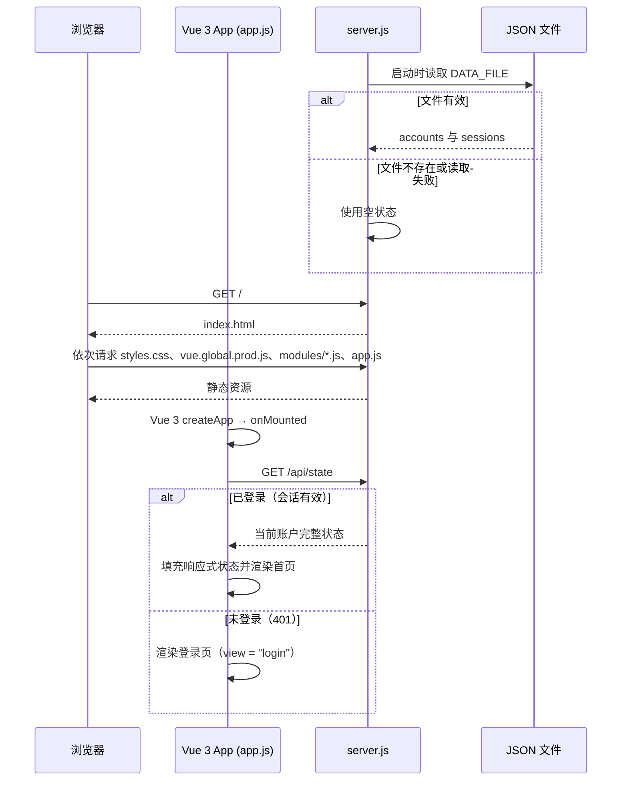
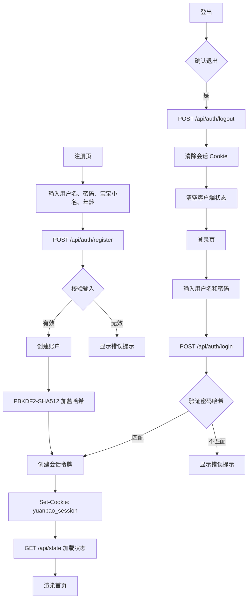
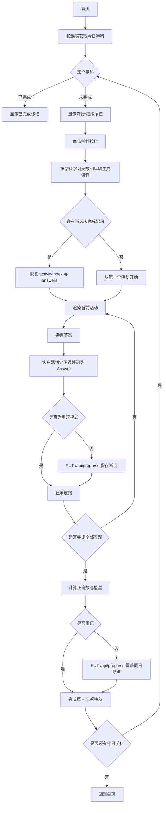
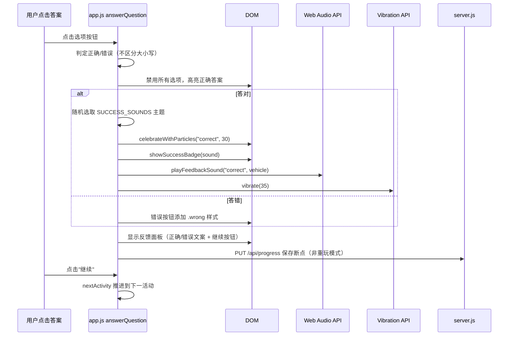
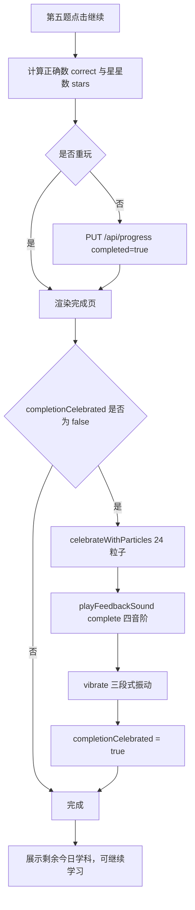
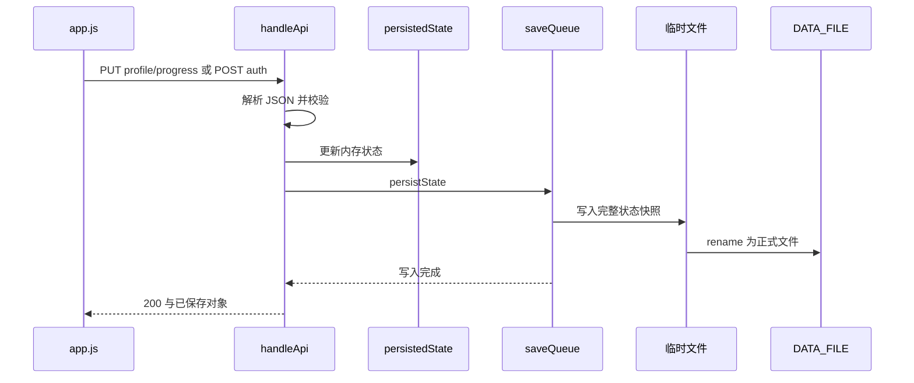
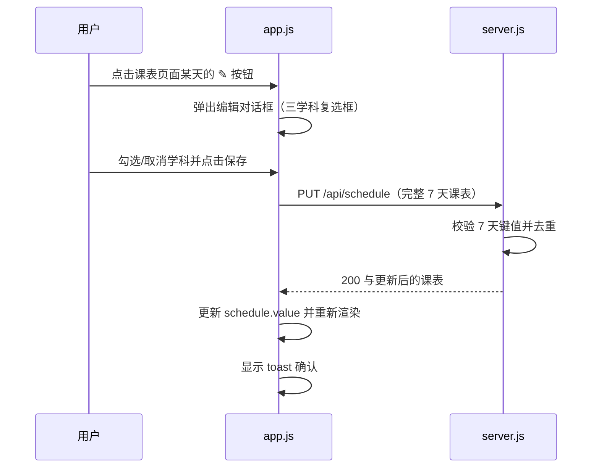

# 运行流程

本文关注运行时顺序与数据流；静态模块职责见[架构说明](./architecture.md)。

## 启动与初始化

服务端启动时读取 `SOURCE_DIR`、`PORT`、`DATA_FILE`，调用 `loadState()` 尝试读取 JSON；文件不存在或读取/解析失败时使用空状态。浏览器加载页面后，Vue 3 应用在 `onMounted` 中请求 `/api/state` 检测登录状态，根据结果选择登录页、注册页或首页。注册页的宝宝小名输入框预填默认值 `"元宝"`（见 [`app.js`](../../app.js) 的 `regChildName`）。依据为 [`server.js`](../../server.js) 和 [`app.js`](../../app.js)。

旧版应用曾依赖浏览器 IndexedDB 存储数据，Vue 3 重构后不再包含 IndexedDB 迁移逻辑。当前客户端仅通过服务端 API 读写数据，见 [`app.js`](../../app.js) 的 `onMounted`、`loadUserState`。仅用户执行"清除全部学习数据"时客户端会尝试删除旧 IndexedDB（`indexedDB.deleteDatabase`），见 `resetData`。

## 认证流程

认证使用 `yuanbao_session` Cookie（HttpOnly、SameSite=Lax、7 天有效期），密码通过 PBKDF2-SHA512（10000 次迭代）加盐哈希存储。见 [`server.js`](../../server.js) 的 `hashPassword`、`createSession`、`destroySession`。

## 建档与每日学习

课程不从服务端下载，而是客户端使用学习天数和年龄调用学科模块的 `generateLesson` 生成。学习天数从 `startedAt` 与客户端本地日期计算，按学科独立统计。种子是 `day * PRIME + age * PRIME`（数学 7919、物理 5821、英语 3719），每节课程包含 5 个活动。依据为 [`app.js`](../../app.js) 的 `computeSubjectDays`、`makeSubjectLesson`、`startSubjectLesson`，以及各学科模块。

首次作答会禁用选项并高亮正确答案。非重玩模式每题立即保存断点；第五题后以 `max(1, round(correct / 2))` 计算星星，并覆盖同日记录。重玩只显示反馈，不改写既有成绩，见 [`app.js`](../../app.js) 的 `startSubjectLesson`、`answerQuestion`、`nextActivity`。

## 答题反馈与庆祝流程

每次答题后，客户端触发多级反馈；所有音效通过 Web Audio API 合成，不依赖外部音频文件。答对时随机选择车辆主题（火车/消防车/警车/校车），见 [`app.js`](../../app.js) 的 `SUCCESS_SOUNDS`、`playFeedbackSound`、`playVehicleSound`。

课程完成时，`nextActivity` 检测到 `activityIndex >= activities.length` 后跳转到 `view = "complete"`，Vue 模板在首次渲染时触发完成庆祝，`completionCelebrated` 标志防止重复：

英语发音使用浏览器的 `speechSynthesis`、`en-US` 语言（rate 0.72、pitch 1.08）；不支持时只显示 toast 提示，学习可继续。答对和完成课程还会尽力调用 Web Audio API 与 `navigator.vibrate` 提供反馈；这些能力不可用或播放失败时不会中断答题流程，见 [`app.js`](../../app.js) 的 `speak`、`playFeedbackSound`、`answerQuestion`、`nextActivity`。

## 服务端写入

请求体限制为 1 MiB。`saveQueue` 避免同一进程内的文件写入交叉；写入的是完整快照而非增量日志，见 [`server.js`](../../server.js) 的 `MAX_BODY_SIZE`、`readJson`、`persistState`。

客户端只有在 `PUT /api/progress` 成功后才将该记录合并进 `records.value`；答题断点写入失败时会保留当前页面上的答题反馈并显示 toast 提示。完成页保存没有单独的 `try/catch`，因此保存失败时的行为由该异步事件处理的异常表现决定，是否有统一的全局错误捕获属于**待确认**；相关实现见 [`app.js`](../../app.js) 的 `saveRecord`、`answerQuestion`、`nextActivity`。

## 统计与导出

- 首页从完成记录计算课程数、连续天数和近七天打卡；当日未完成记录决定进度条，见 [`app.js`](../../app.js) 的 `streak`、`weekDays`、首页模板。
- 成长页统计三个学科（数学/物理/英语）的完成课程数、正确率和星星数，并最多展示最近 10 节，见 [`app.js`](../../app.js) 的 `subjectStats`、`historyItems`。
- 导出功能生成独立 HTML 报告：包含统计卡片（完成课程数/星星数/连续天数）、学科能力条形图和最近 50 条课程记录表，见 [`server.js`](../../server.js) 的 `generateExportHtml`。
- 清除操作需浏览器确认；之后 `DELETE /api/state` 重置记录和开始日期，删除旧 IndexedDB 并刷新，见 [`app.js`](../../app.js) 的 `resetData` 和 [`server.js`](../../server.js)。

## 课表编辑流程

## 相关文档

- [项目概览](./overview.md)：入口与部署位置。
- [架构说明](./architecture.md)：数据结构与 API 边界。
- [开发指南](./development.md)：如何复现、检查与调试这些流程。